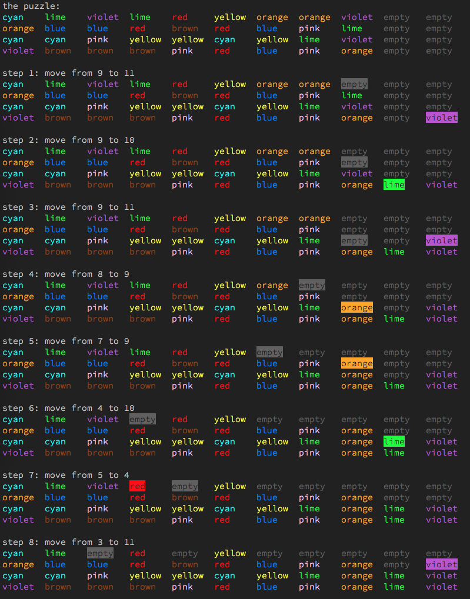

# SortPuz Solver

A simple solver for color water sorting puzzle game like [SortPuz](https://apps.apple.com/us/app/sortpuz-water-puzzles-games/id1560298214), runs in terminal

## Screenshot


## Usage
```
usage: app.py [-h] -l level_number [-q]

SortPuz Solver

optional arguments:
  -h, --help       show this help message and exit
  -l level_number  Required, level number of the SortPuz
  -q               Optional, solve the puzzle quicker but might have longer steps
```
